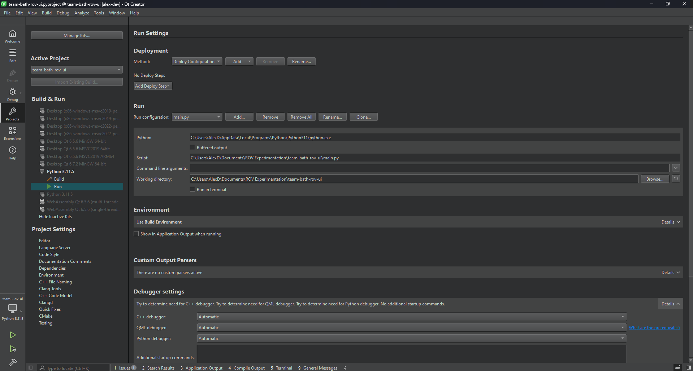
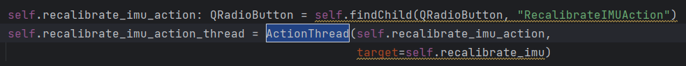

# Team Bath Hydrobotics ROV UI

## Code Standards

Python code should be written to adhere to the [PEP 8 Standard](..%2F..%2F..%2FAppData%2FLocal%2FTemp%2FPEP%208-%20The%20Style%20Guide%20for%20Python%20Code.url) for laying out code to help maintain clear code readability.

Make comments where neccessary to help produce self documenting code!

Type hints should be used where appropriate. This can greatly help with development and debugging; Tools like IntelliJ can use these for providing more accurate code suggestions.

**Do not** overuse comments/use comments to explain trivial tasks.

Use [QT Creator](https://doc.qt.io/qtcreator/creator-how-to-install.html) for designing the layout of the UI, stored in `*.ui` files.

Any code editor should work fine during development; ideally one which aligns with PEP 8.

## Design Overview

Refer frequently to design resources to ensure implementations are fit for purpose. 

User experience and simplicity are crucial aspects of the design.

The system will be used in a time sensitive environment and thus it is important that it is responsive and requires minimal input from the user.

Additionally, the competition strains safety and risk mitigation with the design of our system. This should be reflected within the UI as well as the ROV itself.

Ensuring that the UI is designed to be fault tolerant and gracefully handle unexpected scenarios is essential.

More information can be found below:

[Figma Design](https://www.figma.com/design/CVX1dHaXI9s1b6nb9SfE9z/Team-Bath-Hydrobotics?node-id=0-1&t=LOLOn3gkAG4KWGFB-0)

[User Stories](https://computingservices.sharepoint.com/:w:/r/sites/TeamBathRobotics/Shared%20Documents/Resources/Autonomy%20%26%20Interface%20Team/User%20Interface/Concept%20Designs/User%20Stories.docx?d=wa64ea7a6307a4422a6f4c1185b1a4e85&csf=1&web=1&e=2pIOby)

This README will serve as a document for defining specific code implementations in QT.

## Development Process

Create your own branch of this repo which you can use to push changes to.
Install all dependencies to the project by running the following in the project directory:

`pip install -r requirements.txt`

Code can either be run in your code editor or from QT Creator by running `main.py`.

The project directory for your chosen editor should be within the `/source` folder.

**Note**: QT Creator may require you to specify a run configuration in which case yours should look like the following:

The script attribute should refer to `main.py`

# Implementation

## App Object

The app object inherits from `QApplication` and is used to contain everything related to the UI.

Information pertaining to the current state of the UI should be stored here so that it is globally visible to different widgets in the application.

Other widget objects should contain an attribute referencing to this app object so that they can retrieve shared program information.

**The app stores information including:**

- Tasks
- Timer
- References to each `Window` Widget
- Reference to the `Dock` Widget
- Information about processes that send "dummy" data to the UI (Temporary)

**Signals:**

- `task_checked` - Raised when a checkbox in the list of tasks is changed.
- `camera_initialisation_complete` - Raised when a camera is successfully initialised.

**Methods:**

- `close()` - Closes all windows associated with the application, joins all external threads, closes all associated processes.
- `init_data_interface(redirect_stdout, redirect_stderr)` - Starts the `DataInterface` object in a new thread and sets a reference in each window to this object, so they can access it.
- `reset_task_completion()` - Sets all the tasks to incomplete.

## Task Object

This object inherits `QWidget` and is used to store information about a particular task. This includes a title, description and time when the user should start this task. The `Task` loads a template widget from `task_widget.ui` which contains a checkbox and label for the `start_time`.

**Methods:**

- `set_attr_(key, value)` - Overwritten to update widgets if the `Task`'s attributes are changed.
- `on_check()` - Called when the checkbox is checked/unchecked. This changes the complete attribute and emits `App`'s `Task_Checked` signal.

## DataInterface Object

The `DataInterface` is used to store the current state of the ROV/Float, stdout from the UI and from the ROV and ROV video streams.

This object centrally manages multiple threads, which are each responsible of processing data from a socket connection. 

**Attributes:**

There are attributes for the ROV and float. These attribute names should match exactly to those specified by the `ROVData` and `FloatData` classes.

**Threads:**

Some threads will **emit** a **signal** periodically such as if connection is lost or new data has been receieved.

Some threads will be of type `SockStreamRecv` or `SockStreamSend` if they are **constantly** receiving/sending data.

- `Video Stream Thread`(s - One for each video stream) - Emits `video_stream_update(int)` -  **Port 52524**/**Port 52523**/**Port 52522** - `SockStreamRecv`
- `ROV Data Thread` - Emits `rov_data_update` - **Port 52525** - `SockStreamRecv`
- `ROV Controller Input Thread` - No Emission - **Port 52526** - `SockStreamSend`
- `Stdout UI Thread` - Emits `stdout_update(StdoutType, str)`
- `Stdout ROV Thread` - Emits `stdout_update(StdoutType, str)` - `SockStreamRecv`
- `Float Data Thread` - Emits `float_data_update` - **Port 52625** - `SockStreamRecv`

**Signals:**

These sockets can be connceted to by windows if they are supposed to display information from `DataInterface`

- `rov_data_update()`
- `float_data_update()`
- `video_stream_update(int)`
- `stdout_update(StdoutType, str)`

**Methods:**

Each Thread has it's own function that it runs which are contained inside this class:

- `is_rov_connected()` - Check if the ROV is connected to the UI.
- `is_float_connected()` - Check if Float is connected to the UI.
- `is_controller_connected()` - Check if a controller is connected to the UI.
- `on_rov_data_sock_recv(payload_bytes)` - Takes in bytes from the `ROV Data Thread` and updates ROV attributes in the `DataInterface`. Emits the `rov_data_update()` signal.
- `on_float_data_sock_recv(payload_bytes)` - Takes in bytes from the `Float Data Thread` and Updates Float attributes in the `DataInterface`. Emits the `float_data_update()` signal.
- `on_video_stream_sock_recv(payload_bytes, i)`  Takes in bytes from a `Video Stream Thread` for the *i*th camera and updates `DataInterface.camera_feeds[i]` with the newest frame. Emits `video_stream_update(int)`
- `f_stdout_thread()` - Captures internal UI stdout. Emits the `stdout_update(StdoutType, str)` signal.
- `on_stdout_sock_recv(payload_bytes)` - Listens for stdout sent across from the ROV. Emits the `stdout_update(StdoutType, str)`
- `get_controller_input()` - Called by the `ROV Controller Input Thread` and returns controller input. 

- `close()`

## StdoutTypes

This is an enum class to help represent the types of `stdout` that should be displayed in the window. This includes the following:

- `UI` - General stdout from UI processes will have this type.
- `UI ERR` - Internal errors within the UI will have this type.
- `ROV` - General stdout sent across the stdout socket for the ROV.
- `ROV ERR` - Any errors reported from the ROV via the stdout socket.

## ROVData

This is a **pickleable** object containing metrics from the ROV which are sent across a socket to be recieved by the UI process.

Attribute names in `ROVData` **must match exactly** to a corresponding attibute in `DataInterface`.

**Attributes:**

- `attitude` - Vector3
- `angular_acceleration` - Vector3
- `angular_velocity` - Vector3
- `acceleration` - Vector3
- `velocity` - Vector3
- `depth` - float
- `ambient_temperature` - float
- `ambient_pressure` - float
- `internal_temperature ` - float
- `cardinal_direction` - float
- `grove_water_sensor` - float
- `actuator_1` - float
- `actuator_2` - float
- `actuator_3` - float
- `actuator_4` - float
- `actuator_5` - float
- `actuator_6` - float

## FloatData

This is a **pickleable** object containing metrics from the Float which are sent across a socket to be recieved by the UI process.

Attribute names in `FloatData` **must match exactly** to a corresponding attibute in `DataInterface`.

**Attributes:**

- `float_depth` - float

## VideoStream Object

This is used to store information related to the camera feeds on the ROV.

The key argument of this object is the `camera_frame` which stores a 3D **numpy** array of pixels of shape `height,width,channels` of what the video feed is currently receiving.
This is not to be confused with `camera_feed` which is a `cv2.VideoCapture` object to read frames from. 

The array stored in `camera_frame` is sent across a socket where it is recieved by the `DataInterface` and the UI is updated acordingly.

**Methods:**

- `start_init_camera_feed()` - This creates a thread which runs `init_camera_feed()`
- `init_camera_feed()` - This function attempts to read a frame from the `camera_feed`. If it is successful, it will **emit** the `camera_initialised` signal in the `App` object. Otherwise, it will attempt several more times by recursively calling the function until a maximum number of attempts is reached. At which point, the user must press the `Reinitialise Cameras` action to restart this process. 
- `update_camera_frame()` - The data in `camera_frame` is updated with the newest data read from `camera_feed` *(Note: Testing is needed to see what happens when an initialised camera feed suddenly becomes unavailable. Program should identify and deal with this gracefully beyond just flooding the console with "Could not read...")*
- `generate_pixmap(camera_frame, target_width, target_height)` - a static method for translating a 3D numpy array `camera_frame` into a `QPixmap` object of a desired size. Aspect ratio of the image is maintained.

## SOCK_STREAM Threads

The following two classes provide a robust protocol for sending and receiving various different messages over SOCK_STREAM sockets.

### SockStreamRecv

**Init Parameters:**

- `app` - The UI app object if applicable so the thread will close gracefully. App = None is allowed otherwise but this is blocking.  
- `connected` - A boolean that indicates if a connection is sending data.
- `addr` - The **IP Address** that the connection will be bound to.
- `port` - The port the socket is bound to. 
- `on_recv` - A function that can be passed which will be called whenever a new message is recieved.
- `on_disconnect` - A function that can be passed which will be called whenever a socket connection closes.

**Protocol:**

1. Listen for a new connection on the specified `port` and `addr` (this will timeout if one is not found and then will repeat **1.**)
2. A connection is established.
3. A buffer (referred to as `incoming_bytes`) is created for holding bytes read from the socket buffer. A flag to indicate the start of a new message is created (referred to as `read_start`) and is set to **true**. A final buffer stores our recieved `payload`.
4. Bytes are sent across the socket and placed into a 1MB socket buffer.
5. Bytes are read from the socket buffer and appended to `incoming_bytes`
6. If `read_start` is **true** (We are at the start of a new message), extract the header from the start of `incoming_bytes` and continue to **7.** Otherwise we go to **9.**
7. From our `header` we extract the `msg_size` and time that the message was sent. `read_start` is set to **false**
8. The `header` is removed from `incoming_bytes`
9. `incoming_bytes` are appended to `payload`
10. If the size of our `payload` is larger than our expected `msg_size` we have recieved our whole message. Otherwise we empty `incoming_bytes` and go back to **4.**
11. `payload` is truncated to our `msg_size`. `incoming_bytes` is emptied and subsequent bytes after `msg_size` in `payload` are placed into `incoming_bytes`
12. `read_start` is set back to **true** to read the next message. The thread's `on_recv` is called. We go back to **4.**

If at any point a connection becomes unresponsive(times out) or causes a connection error, the thread will return to **1.**
If this occurs, `on_disconnect` is called.

### SockStreamSend

***NOTE: If `sleep` is set to a low value, the thread may be sending data faster than the recieving socket can cope with. This can lead to degredation in the responsiveness in connections. For now ensure `sleep` is of a sufficient value to avoid this. Ideally, this should be fixed.***

- `app` - The UI app object if applicable so the thread will close gracefully. App = None is allowed otherwise but this is blocking.  
- `connected` - A boolean that indicates if a connection is receiving data.
- `addr` - The **IP Address** that the connection will be bound to.
- `port` - The port the socket is bound to.
- `sleep` - The interval in seconds the thread should wait before sending the next message. 
- `get_data` - A function that can be passed which is used to provide data to send across the socket.
- `on_disconnect` - A function that can be passed which will be called whenever a socket connection closes.

**Protocol:**

1. Attempt to connect to the specified `port` and `addr` (this will timeout if one is not found and then will repeat **1.**)
2. A connection is established.
3. The thread will sleep the amount of time specified by `sleep`.
4. Data is recieved from `get_data()`. If no data is provided, we return to 3.
5. Create the payload. This begins with the **header**, consisting of `msg_size` (number of bytes after the header in this message) and the time the message is being sent. The data is converted to bytes and added to the end.
6. Send the payload across the socket.

If at any point a connection becomes unresponsive(times out) or causes a connection error, the thread will return to **1.**
If this occurs, `on_disconnect` is called.

### SockSend

This is a function that can be used to send a one-off message to a thread. 
For this function you can specify the following parameters:

- `app` - The UI app object if applicable so the thread will close gracefully. App = None is allowed otherwise but this is blocking.  
- `addr` - The **IP Address** that the connection will be bound to.
- `port` - The port the socket is bound to.
- `msg` - Message to send across the socket

It will behave very similarly to SockStreamSend and will ensure the message is sent. **This function is blocking**. Ideally run this function on its own thread.

## Window Widget

***NOTE: Current implementation only supports 1920x1080 displays. This needs to be modified.***

Each window is a frameless, full screen window (1920x1080) that can be moved around to different monitors using the `NavBar` at the top of the screen. A window will automatically reposition itself to ensure the entire window is visible. 

The `Window` class is a subclasses of `QFrame`s and is a container for all UI content within a window. 
The `Window` class should not be used directly but only through the subclasses `Pilot`,`Copilot` and`Grapher`. 
Each window should load all static widgets through a `.ui` of the same name. 

Widgets inside a window can be referenced like so:

Including type hints here makes development much easier.

The `__init__` method takes three arguments:

- file - The `*.ui` file to be loaded into the window.
- app - The `App` parent to this window. The window can reference this to get global data.
- monitor - A `Monitor` object from the `screeninfo` library. This is used to determine which monitor the window should appear on at launch.

**Methods:**

- `attach_nav_bar()` - Used on startup by the `App` object to build the window's `NavBar`
- `attach_data_interface()` - Should be overridden by subclasses if their window requires connecting to `DataInterface` signals.
- `close_event()` - Triggered by the window closing. If a window closes, so should the entire app.

## Dock Widget

The `Dock` widget inherits from `QStackedWidget` and allows multiple `Window` objects to be stacked ontop of each other if there are not enough displays available.
See the section on the `NavBar` widget as that is used in conjunction with the `Dock` to allow the user to switch between the different windows in the stack.

Whenever a widget is added(docked) or removed(undocked), `on_dock_change()` is called.

When `Window` at the top of the stack changes, the `WindowTitle` propertty of the `Dock` is changed.

**Methods:**

- `add_windows(*windows)` - adds windows to the stack. Calls `on_dock_change()`
- `on_dock_change()` - rebuilds the `NavBar` for each `Window` in the stack.
- `close_event()` - triggered the window is closing. If a window closes, so should the entire app.

## NavBar Widget

Each window has a custom navigation bar at the top of the screen to override the default one provided by Windows.

It provides functionality for **moving a window to a different screen**, **minimising** and **closing** windows and **docking/undocking** windows.
For docked windows, the navbar will list all other docked windows that the user can switch to and view.

**Methods:**

- `generate_layout()` - Creates `QPushButton`s for each standard button and `NavWindowButton`s for each docked window. These are displayed on the `NavBar`.
- `clear_layout(layout)` - Removes all of the `QPushButton`s from the `NavBar` layout.
- `minimise()` - minimises the `Dock` if the parent `Window` is *docked* and minimises the parent `Window` itself if it is *undocked*.
- `f_dock()` - adds the parent `Window` to the `Dock`
- `f_undock()` - removes the parent `Window` to the `Dock` and creates the `Window` in a standalone frame.
- `mousePressEvent(event)` - an event to set the start position of the cursor when dragging the `NavBar`.
- `mouseReleaseEvent(event)` - on release, the window should be maximised to fit the monitor it predominantly occupies.
- `mouseMoveEvent(event)` - reposition the window while the user is holding and dragging the cursor.

# Window Subclass Overview

In the below sections are more details about the implementation of each of the three windows in the application.

The bulk of most of these subclasses contain mostly trivial, repetitive defining of attributes for accessing widgets using `self.findChild()` (See example in the `Window` section above for more info).

These should override `attach_data_interface` if a window requires connecting to a `DataInterface` signal.

# Pilot Window

**This window should display:**

- All `VideoStream`s.
- Current `Task` information.
- Temperature and pressure data.
- Critical Alerts
- A 3D model of the ROV
- Timer

**Signal Connections:**

-  `App` `task_checked()` -> `on_task_change()`
- `DataInterface` `video_stream_update(i)` -> `update_video_data(i)`

**Methods:**

- `on_task_change()` - The current and next tasks are retrieved and all associated widgets are updated. Current and next tasks are not necessarily contiguous.
- `attach_data_interface()` - Connects to `DataInterface` signals.
- `update_video_data()` - Called when the `video_stream_update` signal is emmitted. Displays the new frame on the UI for the *i*th camera. 

# Copilot Window

**This window should display:**

- Sensor data from the ROV via the `DataInterface`
- ROV settings
- **Stdout** from the ROV and UI
- Actions
- Alerts
- Main `VideoStream`
- Task Checklist
- Timer

**Signal Connections:**

- `DataInterface` `rov_data_update` -> `update_rov_data`
- `DataInterface` `float_data_update` -> `update_float_data`
- `DataInterface` `video_stream_update` -> `update_video`
- `DataInterface` `stdout_update` -> `update_stdout`

**Methods:**

- `secs_to_minsec(secs)` - Formats an integer **secs** into a string of form **"mm:ss"**
- `start_timer()` - Starts a `QTimer` object if one has not already been started.
- `stop_timer()` - Stops the `QTimer`. The *stop* widget will become *reset*. If this function is called when the timer is already stopped, it will reset the timer and set all `Task`s to incomplete.
- `timer_timeout()` - Called every second. Updates the timer widgets through `update_time`.
- `update_time()` - Updates the progress bar and remaining text label.
- `build_task_widgets()` - Used in `__init__` to add all `Task` widgets to the `TaskList` container. The `TaskList` is also resized to fit the number of task widgets added. A scrollbar will appear if these overflow.
- `reinitalise_cameras()` - Called when the associated `Action` button is pressed. Each `VideoStream` is re-initialised with `start_init_camera_feed()`
- `check_camera_initialisation_complete()` - Connected to `App`'s `camera_initialisation_complete` signal which is emitted from a `VideoStream` when it successfully initialises. This checks if all `VideoStreams` are finishing trying to initialise so the `Action` button can be unchecked.
- `set_sonar_value(widget, value, value_max` - Set sonar widgets's text to "<vale> cm". If the value exceeds *value_max* then "<value_max> cm" is displayed instead.
- `update_stdout(source, line)` - Writes a new line to the `stdout_window` and preappends the stdout source of this line.
- `update_rov_data()` - If the ROV is connected, it will display the latest values stored in `DataInterface`. Otherwise, all ROV attributes will display "ROV Disconnected".
- `update_float_data()` - If the Float is connected, it will display the latest values stored in `DataInterface`. Otherwise, all Float attributes will display "Float Disconnected."
- `update_video()` - Called when the `video_stream_update` signal is emmitted. Displays the new frame on the UI for the main camera. Any other camera event is ignored.

### ActionThread

This class inherits from Thread.

Actions are functions that the user can perform in the UI when a `QRadioButton` is pressed.
These may take some time to complete and so they run **asynchronously** to the main thead to prevent freezing.

A new action can assigned using the `ActionThread` class.

E.g.

`ActionThread` takes two required arguments and one optional argument:

- action - The `QRadioButton` to bind to.
- target - The main function which should run when the `action` is clicked.
- retain_state(optional. defaults to **False**) - If set to **True**, the action is togglable. 

