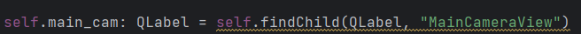

# Team Bath Hydrobotics ROV UI

## Code Standards

Python code should be written to adhere to the [PEP 8 Standard](..%2F..%2F..%2FAppData%2FLocal%2FTemp%2FPEP%208-%20The%20Style%20Guide%20for%20Python%20Code.url) for laying out code to help maintain clear code readability.

Make comments where neccessary to help produce self documenting code!

Type hints should be used where appropriate. This can greatly help with development and debugging; Tools like IntelliJ can use these for providing more accurate code suggestions.

**Do not** overuse comments/use comments to explain trivial tasks.

Use [QT Creator](https://doc.qt.io/qtcreator/creator-how-to-install.html) for designing the layout of the UI, stored in `*.ui` files.

Any code editor should work fine during development; ideally one which aligns with PEP 8.

## Design Overview

Refer frequently to design resources to ensure implementations are fit for purpose. 

User experience and simplicity are crucial aspects of the design.

The system will be used in a time sensitive environment and thus it is important that it is responsive and requires minimal input from the user.

Additionally, the competition strains safety and risk mitigation with the design of our system. This should be reflected within the UI as well as the ROV itself.

Ensuring that the UI is designed to be fault tolerant and gracefully handle unexpected scenarios is essential.

More information can be found below:

[Figma Design](https://www.figma.com/design/CVX1dHaXI9s1b6nb9SfE9z/Team-Bath-Hydrobotics?node-id=0-1&t=LOLOn3gkAG4KWGFB-0)

[User Stories](https://computingservices.sharepoint.com/:w:/r/sites/TeamBathRobotics/Shared%20Documents/Resources/Autonomy%20%26%20Interface%20Team/User%20Interface/Concept%20Designs/User%20Stories.docx?d=wa64ea7a6307a4422a6f4c1185b1a4e85&csf=1&web=1&e=2pIOby)

This README will serve as a document for defining specific code implementations in QT.

## Development Process

Create your own branch of this repo which you can use to push changes to.
Install all dependencies to the project by running the following in the project directory:

`pip install -r requirements.txt`

Code can either be run in your code editor or from QT Creator by running `main.py`.

Note: QT Creator may require you to specify what file it should initially run.

The script attribute should refer to `main.py`

# Implementation

## App Object

The app object inherits from `QApplication` and is used to contain everything related to the UI.

Information pertaining to the current state of the UI should be stored here so that it is globally visible to different widgets in the application.

Other widget objects should contain an attribute referencing to this app object so that they can retrieve shared program information.

**The app stores information including:**

- Tasks
- Timer
- References to each `Window` Widget
- Reference to the `Dock` Widget

**Signals:**

- `task_checked` - Raised when a checkbox in the list of tasks is changed.
- `camera_initialisation_complete` - Raised when a camera is successfully initialised.

**Methods:**

- `close()` - Closes all windows associated with the application and joins all external threads.
- `init_data_interface(redirect_stdout, redirect_stderr)` - Starts the `DataInterface` object in a new thread and sets a reference in each window to this object, so they can access it.
- `reset_task_completion()` - Sets all the tasks to incomplete.

## Task Object

This object inherits `QWidget` and is used to store information about a particular task. This includes a title, description and time when the user should start this task. The `Task` loads a template widget from `task_widget.ui` which contains a checkbox and label for the `start_time`.

**Methods:**

- `set_attr_(key, value)` - Overwritten to update widgets if the `Task`'s attributes are changed.
- `on_check()` - Called when the checkbox is checked/unchecked. This changes the complete attribute and emits `App`'s `Task_Checked` signal.

## DataInterface Object

***Note:***

*Currently, the `DataInterface` randomly generates information about the ROV.
This needs to be amended so that the `DataInterface` communicates with an external process via a **socket** to retrieve data.
Of course, a separate process can be used to send random data via a **socket** for now. 
But the framework should be in place so when the ROV is available, we can simply connect the **socket** someplace else.*

****

The `DataInterface` is used to store the current state of the ROV/Float as well as additional data that may have been collected from them.
This object runs in a second thread for the lifetime of the UI. Whenever new data is ready, each `Window`'s `on_update` (`pyqtSignal`) is **emitted**.

**Methods:**

- `run` - Continuously retrieve data and video from the ROV/Float (60 times per second). Redirected **stdout** is printed to the console and it is added to the `DataInterface`'s `lines_to_add` argument. This is referenced by the `Copilot` to display **stdout** in the window.  

## VideoStream Object

*Note:*

*Some of this code may need to be altered/moved to the ROV itself when video feed is received from the ROV rather than from local webcams.*

****

This is used to store information related to the camera feeds on the ROV.

The key argument of this object is the `camera_frame` which stores a **numpy**-style 2D array of pixels of what the video feed is currently receiving.
This is not to be confused with `camera_feed` which is a `cv2.VideoCapture` object to read frames from.

**Methods:**

- `start_init_camera_feed()` - This creates a thread which runs `init_camera_feed()`
- `init_camera_feed()` - This function attempts to read a frame from the `camera_feed`. If it is successful, it will **emit** the `camera_initialised` signal in the `App` object. Otherwise, it will attempt several more times by recursively calling the function until a maximum number of attempts is reached. At which point, the user must press the `Reinitialise Cameras` action to restart this process. 
- `update_camera_frame()` - The data in `camera_frame` is updated with the newest data read from `camera_feed` *(Note: Testing is needed to see what happens when an initialised camera feed suddenly becomes unavailable. Program should identify and deal with this gracefully beyond just flooding the console with "Could not read...")*
- `generate_pixmap(target_width, target_height)` - translates the `camera_frame` into a `QPixmap` object of a desired size. Aspect ratio of the image is maintained.
## Window Widget

Each window is a frameless, full screen window (1920x1080) that can be moved around to different monitors using the `NavBar` at the top of the screen.

The `Window` class is a subclasses of `QFrame`s and is a container for all UI content within a window. 
The `Window` class should not be used directly but only through the subclasses `Pilot`,`Copilot` and`Grapher`. 
Each window should load all static widgets through a `.ui` of the same name. 

Widgets inside a window can be referenced like so:

Including type hints here makes development much easier.

The `__init__` method takes three arguments:

- file - The `*.ui` file to be loaded into the window.
- app - The `App` parent to this window. The window can reference this to get global data.
- monitor - A `Monitor` object from the `screeninfo` library. This is used to determine which monitor the window should appear on at launch.

The window object contains a `pyqtSignal` called `on_update`.
This acts as an event which causes the `update_data` event to be triggered 
(This is triggered by the `DataInterface` whenever there is new data to present).
Each subclass of `Window` should override this method so it can update widgets in that window.

**Signals:**

- `on_update` - Raised when the `DataInterface` has new data.

**Methods:**

- `attach_nav_bar()` - Used on startup by the `App` object to build the window's `NavBar`
- `update_data()` - Event handler for when the `DataInterface` has new data, indicated by the emission of the `on_update` signal.
- `close_event()` - Triggered by the window closing. If a window closes, so should the entire app.

## Dock Widget

The `Dock` widget inherits from `QStackedWidget` and allows multiple `Window` objects to be stacked ontop of each other if there are not enough displays available.
See the section on the `NavBar` widget as that is used in conjunction with the `Dock` to allow the user to switch between the different windows in the stack.

Whenever a widget is added(docked) or removed(undocked), `on_dock_change()` is called.

When `Window` at the top of the stack changes, the `WindowTitle` propertty of the `Dock` is changed.

**Methods:**

- `add_windows(*windows)` - adds windows to the stack. Calls `on_dock_change()`
- `on_dock_change()` - rebuilds the `NavBar` for each `Window` in the stack.
- `close_event()` - triggered the window is closing. If a window closes, so should the entire app.

## NavBar Widget

Each window has a custom navigation bar at the top of the screen to override the default one provided by Windows.

It provides functionality for **moving a window to a different screen**, **minimising** and **closing** windows and **docking/undocking** windows.
For docked windows, the navbar will list all other docked windows that the user can switch to and view.

**Methods:**

- `generate_layout()` - Creates `QPushButton`s for each standard button and `NavWindowButton`s for each docked window. These are displayed on the `NavBar`.
- `clear_layout(layout)` - Removes all of the `QPushButton`s from the `NavBar` layout.
- `minimise()` - minimises the `Dock` if the parent `Window` is *docked* and minimises the parent `Window` itself if it is *undocked*.
- `f_dock()` - adds the parent `Window` to the `Dock`
- `f_undock()` - removes the parent `Window` to the `Dock` and creates the `Window` in a standalone frame.
- `mousePressEvent(event)` - an event to set the start position of the cursor when dragging the `NavBar`.
- `mouseReleaseEvent(event)` - on release, the window should be maximised to fit the monitor it predominantly occupies.
- `mouseMoveEvent(event)` - reposition the window while the user is holding and dragging the cursor.

# Window Subclass Overview

In the below sections are more details about the implementation of each of the three windows in the application.

The bulk of most of these subclasses contain mostly trivial, repetitive defining of attributes for accessing widgets using `self.findChild()` (See example in the `Window` section above for more info).
This is also true for the `update_data` methods these classes provide. This documentation will focus more on the unique features of each subclass.

# Pilot Window

**This window should display:**

- All `VideoStream`s.
- Current `Task` information.
- Temperature and pressure data.
- Critical Alerts
- A 3D model of the ROV
- Timer

It connects to the `App`'s `task_checked` signal where `on_task_change` is called.

**Methods:**

- `on_task_change()` - The current and next tasks are retrieved and all associated widgets are updated. Current and next tasks are not necessarily contiguous.
- `update_data()` - Each camera is updated to display the latest video frames.

# Copilot Window

**This window should display:**

- Sensor data from the ROV via the `DataInterface`
- ROV settings
- **Stdout** from the ROV and UI
- Actions
- Alerts
- Main `VideoStream`
- Task Checklist
- Timer

**Methods:**

- `secs_to_minsec(secs)` - Formats an integer **secs** into a string of form **"mm:ss"**
- `start_timer()` - Starts a `QTimer` object if one has not already been started.
- `stop_timer()` - Stops the `QTimer`. The *stop* widget will become *reset*. If this function is called when the timer is already stopped, it will reset the timer and set all `Task`s to incomplete.
- `timer_timeout()` - Called every second. Updates the timer widgets through `update_time`.
- `update_time()` - Updates the progress bar and remaining text label.
- `build_task_widgets()` - Used in `__init__` to add all `Task` widgets to the `TaskList` container. The `TaskList` is also resized to fit the number of task widgets added. A scrollbar will appear if these overflow.
- `reinitalise_cameras()` - Called when the associated `Action` button is pressed. Each `VideoStream` is re-initialised with `start_init_camera_feed()`
- `check_camera_initialisation_complete()` - Connected to `App`'s `camera_initialisation_complete` signal which is emitted from a `VideoStream` when it successfully initialises. This checks if all `VideoStreams` are finishing trying to initialise so the `Action` button can be unchecked.
- `set_sonar_value(widget, value, value_max` - Set sonar widgets's text to "<vale> cm". If the value exceeds *value_max* then "<value_max> cm" is displayed instead.
- `update_data()` - Sets all values for the sensor data panel, consumes `lines_to_add` from the `DataInterface` to display new *stdout* lines and displays the main camera frame.

The following `Action` methods are **NOT FULLY IMPLEMENTED** yet but are called when their associated `Action` button is pressed.
- `recalibrate_imu` - **NOT FULLY IMPLEMENTED**
- `on_rov_power` - **NOT FULLY IMPLEMENTED**
- `check_thrusters` - **NOT FULLY IMPLEMENTED**
- `check_actuators` - **NOT FULLY IMPLEMENTED**
- `maintain_depth` - **NOT FULLY IMPLEMENTED**

